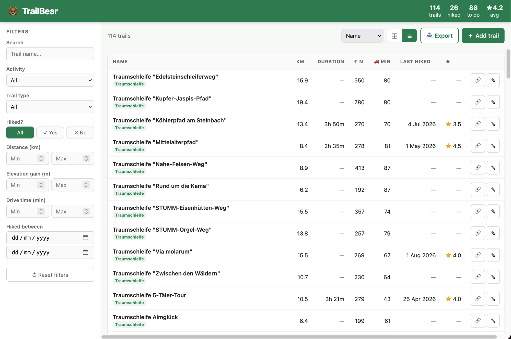

# TrailBear

TrailBear is an MCP server (plus REST API and web UI) for tracking hiking
trails, executions, and impressions — built on a modern `src/` Python
package layout with `uv` project metadata.

It started as a general "mcp-servers" collection; the driving-distance MCP
server is still included, but trails is now the primary purpose of this repo.



## Repository layout

```text
.
├── pyproject.toml
├── src/
│   └── mcp_servers/
│       ├── driving_distance/
│       │   └── mcp.py
│       ├── trails/
│       │   ├── mcp.py               # MCP server (stdio/HTTP)
│       │   ├── repository.py        # SQLite-backed repository
│       │   ├── http_repository.py   # Repository client for remote HTTP mode
│       │   ├── api.py               # REST API
│       │   └── server.py            # REST API + web UI, served together
│       ├── web/
│       │   └── app.py
│       └── runners/
│           ├── stdio_driving.py
│           └── stdio_trails.py
├── ui/
│   └── index.html
├── smoke_test.sh
├── Dockerfile
├── docker-compose.yml
└── assets/
```

## Install (uv)

```bash
uv venv
source .venv/bin/activate
uv pip install -e .
```

## Run servers

HTTP MCP server (driving distance):

```bash
mcp-http
```

Driving distance stdio server:

```bash
mcp-driving-stdio
```

Trails stdio server:

```bash
mcp-trails-stdio
```

## Driving distance MCP tools

- `get_driving_info`
- `compare_routes`

The MCP Streamable HTTP endpoint is served directly at `/`.

## Trails MCP tools

- `import_trails_from_asset`
- `list_trails`
- `get_trail`
- `add_trail`
- `edit_trail`
- `add_execution`
- `edit_execution`
- `delete_execution`
- `add_impression`
- `edit_impression`
- `delete_impression`
- `list_executions`
- `list_impressions`
- `set_trail_garmin_course` (Garmin URL only)

`add_impression` requires an existing `execution_id`.
Use `add_execution` first when needed.

By default the trails database lives at `data/trails.db` (repo-local, created
automatically on first run — see [Data / first-time setup](#data--first-time-setup)).

Override with env var:

```bash
TRAILS_DB_URL=sqlite:///absolute/path/to/trails.db
```

## Data / first-time setup

The SQLite database (`data/trails.db`) and its backups are **not** checked
into the repo — they hold personal trail data and are gitignored. When you
clone the repo, `data/` starts empty.

No manual setup is required: the tables (`trails`, `executions`,
`impressions`) are created automatically (`CREATE TABLE IF NOT EXISTS`) the
first time a server touches the database. Just run any of the servers above
and `data/trails.db` will be created for you.

If you want to seed some starter trails, use the `import_trails_from_asset`
MCP tool against a GeoJSON/JSON file (see `assets/`), or start from an empty
database and add trails via `add_trail`.

To point at a database somewhere else instead (e.g. a shared location or an
existing export), set the env var before starting a server:

```bash
export TRAILS_DB_PATH=/absolute/path/to/trails.db   # HTTP server
# or
export TRAILS_DB_URL=sqlite:///absolute/path/to/trails.db  # stdio server
```

## Smoke test

```bash
chmod +x smoke_test.sh
./smoke_test.sh http://127.0.0.1:8000
```

## Docker

```bash
docker build -t trailbear .
docker run --rm -p 8080:8080 -v "$(pwd)/data:/data" trailbear
```

Or with `docker compose up`, using the provided `docker-compose.yml`.

Container command uses `mcp-trails-http`, serving the REST API and web UI
together on port 8080.

## Claude Custom Connector URL

Use the public URL of your deployment (matching `MCP_PUBLIC_BASE_URL`), e.g.:

`https://mcp.your-domain.example/`
